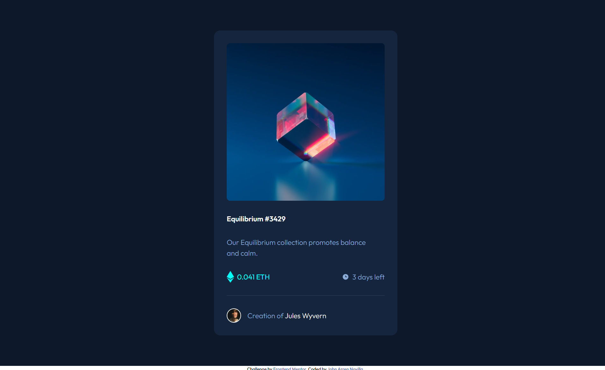
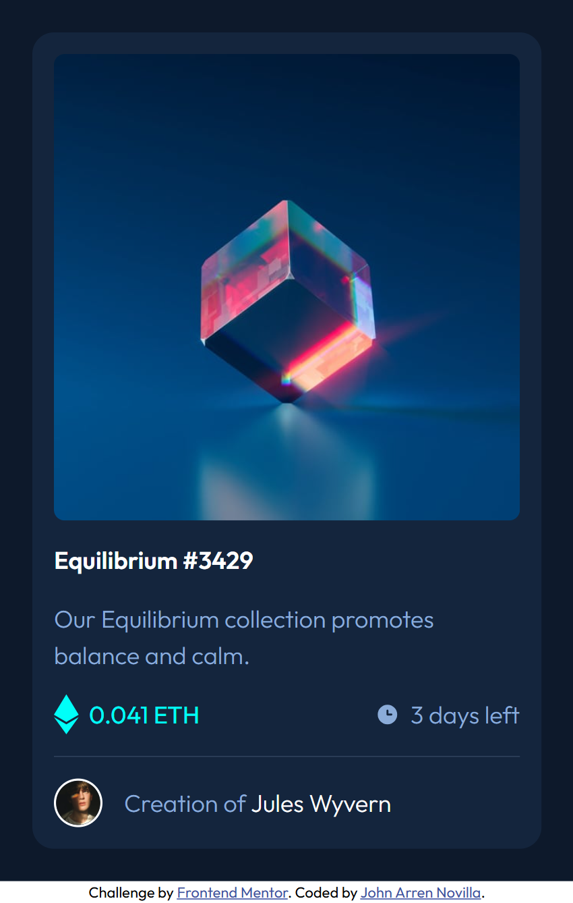

# Frontend Mentor - NFT preview card component solution

This is a solution to the [NFT preview card component challenge on Frontend Mentor](https://www.frontendmentor.io/challenges/nft-preview-card-component-SbdUL_w0U). Frontend Mentor challenges help you improve your coding skills by building realistic projects.

## Table of contents

- [Overview](#overview)
  - [The challenge](#the-challenge)
  - [Screenshot](#screenshot)
  - [Links](#links)
- [My process](#my-process)
  - [Built with](#built-with)
  - [What I learned](#what-i-learned)
  - [Continued development](#continued-development)
  - [Useful resources](#useful-resources)
- [Author](#author)

## Overview

### The challenge

Users should be able to:

- View the optimal layout depending on their device's screen size
- See hover states for interactive elements

### Screenshot

### Links

- Solution URL: [https://github.com/jarren15/nft-preview-card-component-challenge](https://github.com/jarren15/nft-preview-card-component-challenge)
- Live Site URL: [https://jarren15.github.io/nft-preview-card-component-challenge/](https://jarren15.github.io/nft-preview-card-component-challenge/)

## My process

### Built with

- HTML
- SCSS

### What I learned

During this challenge, I deepened my understanding of CSS methodologies and architecture by applying a hybrid approach that combined BEM (Block Element Modifier) with SMACSS (Scalable and Modular Architecture for CSS). This combination helped me write cleaner, more maintainable code by promoting consistency in class naming while also encouraging a modular and scalable structure across components.

I also adopted a mobile-first approach throughout the project, which not only ensured better performance on smaller devices but also helped me build a more responsive and user-centered design from the ground up. Starting with the smallest screens forced me to prioritize essential elements and progressively enhance the layout for larger viewports.

Overall, this challenge strengthened both my technical workflow and my focus on user experience.

### Continued development

Moving forward, I want to continue refining my use of CSS methodologies, particularly the combination of BEM and SMACSS. While this hybrid approach has improved the structure and readability of my stylesheets, I’m still working on fully mastering how to balance both methodologies effectively in larger, more complex projects.

I also plan to keep building on my mobile-first workflow. Although I've seen the benefits of this approach in creating responsive designs, I’d like to further improve my ability to anticipate layout challenges across various breakpoints and optimize performance on a broader range of devices.

These techniques have proven valuable, and I aim to strengthen my understanding and execution of them through more practice and exposure to diverse project requirements.

### Useful resources

- [Responsive Web Design - Media Queries](https://www.w3schools.com/css/css_rwd_mediaqueries.asp)

## Author

- Website - [John Arren Novilla](https://jarrendevs.webflow.io/)
- Frontend Mentor - [@jarren15](https://www.frontendmentor.io/profile/jarren15)
- LinkedIn - [John Arren Novilla](https://www.linkedin.com/in/john-arren-novilla-bb815b160/)
